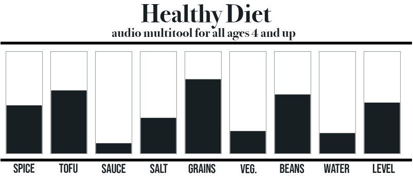

# Healthy Diet: A Wholesome Audio Experience
Welcome to "Healthy Diet," an audio plugin that brings a touch of humor and organic flavor to your audio production table. As audio developers, we often find ourselves in a complex mix of waves and frequencies, much like the varied ingredients of a well-balanced meal. With Healthy Diet, we invite you to season your tracks with the essence of sonic nutrition, all while keeping a light-hearted spirit in the creative process.

## Dive In
We invite you to roll up your sleeves, toss in your favorite sounds, and see what delicious audio concoctions you can create. Healthy Diet is more than just a plugin; it's a chance to play with your food without getting a stern look from your mother. So, let's mix, let's play, and let's make something unforgettable.



Download for [Mac](https://github.com/algoravioli/MULTITOOL_HEALTHYDIET/releases/download/v1.3.3/Healthy.Diet-1.3.3-macOS.dmg) | Download for [Windows](https://github.com/algoravioli/MULTITOOL_HEALTHYDIET/releases/download/v1.3.3/Healthy.Diet-1.3.3-Windows.exe) | Download for [Linux](https://github.com/algoravioli/MULTITOOL_HEALTHYDIET/releases/download/v1.3.3/Healthy.Diet-1.3.3-Linux.zip)

Thank you for considering Healthy Diet for your audio production needs. We can't wait to hear the sonic delicacies you'll whip up with a pinch of creativity and a sprinkle of fun.

QUICK NOTE ABOUT INSTALLING ON MAC (SOMETIMES THIS MIGHT OCCUR)
- I am unable to drag and drop into my folder

``` This is solved with a manual copy and paste ```

- Permission problems with opening the installer

``` Try right-click + open on the installer ```

- Logic Pro X can't find the plugin
  
``` There might be a seperate AU/Components folder located in {user}/Library/Audio/Plug-Ins... ```

``` It might be hidden so try revealing hidden files and folders using Command + Shift + . (period) ```

## Overview
Healthy Diet is not just another audio plugin; it's a fresh approach to sound modulation. Each slider on the interface represents an essential component of a nutritious salad, allowing you to adjust and blend your audio ingredients to perfection. From the robust body of "Beans" to the piquant zest of "Spice," this plugin ensures your audio mix is bursting with flavor and vitality. 

### Nonlinear Ingredient Mixing
In addition, just as the complexities of mixing different ingredients in a salad are nonlinear, the control interaction logic in Healthy Diet offers a myriad of possible flavors as the sliders each depend on other sliders level. Taste it for yourself to see what combinations you come up with.

### In Good Taste
Designed with both the seasoned audio chef and the home aural food preparer in mind, Healthy Diet is intuitive enough for beginners yet robust for professionals. Whether you're looking to add a dash of freshness to a stale mix or craft an entire soundscape from scratch, Healthy Diet is your go-to audio culinary tool.

### Features

- **Spice:** This slider infuses your track with harmonic excitement, sprinkling your sonic dish with clarity and a sharp edge, much like a dash of your favorite seasoning.

- **Tofu:** The protein of your mix, Tofu solidifies the low end, ensuring a robust foundation that supports without overwhelming the overall taste of your audio. This slider blends the original signal with a filtered signal.

- **Sauce:** Sauce is the essence that ties every mix together, with a sweet dynamic compression that enriches and complements the sonic flavors of your track.

- **Salt:** Just like the right pinch of Salt brings out the best in food, this slider accentuates the presence in your audio, highlighting nuances and adding high frequencies to the mix.

- **Grains:** The hearty foundation of any track, Grains deliver a satisfying warmth, making your mix feel full-bodied and rich with some dirty reverb effects.

- **Vegetables (Veg.):** Vegetables add a fresh dimension to your sound, giving your mix a healthy foundation with enhanced low frequencies that keep your mix vibrant and dynamic.

- **Beans:** Like the fiber-rich staple of any diet, Beans deliver a extremely mild compression smooths out the dynamics for a fuller, richer sound.

- **Water:** Maintain the hydration of your effects with Water, providing a medium squeeze to keep everything in check.

- **Level:** Essential for balance, monitor the overall well-being of your mix with Level, i.e Volume.

## Usage

Healthy Diet is a versatile plugin, ideal for mixing engineers and producers looking to add character and dimension to their tracks. With low CPU usage, it's suitable for studio recordings, live performances, and everything in between. 

## Compatibility

Compatible with all major digital audio workstations (DAWs), Healthy Diet is served in VST, AU, and AAX formats to suit every chef's kitchen.

## License 
MIT License

Copyright (c) 2024 Algoravioli - Christopher Clarke
Template by Sudara Williams

Permission is hereby granted, free of charge, to any person obtaining a copy
of this software and associated documentation files (the "Software"), to deal
in the Software without restriction, including without limitation the rights
to use, copy, modify, merge, publish, distribute, sublicense, and/or sell
copies of the Software, and to permit persons to whom the Software is
furnished to do so, subject to the following conditions:

The above copyright notice and this permission notice shall be included in all
copies or substantial portions of the Software.

THE SOFTWARE IS PROVIDED "AS IS", WITHOUT WARRANTY OF ANY KIND, EXPRESS OR
IMPLIED, INCLUDING BUT NOT LIMITED TO THE WARRANTIES OF MERCHANTABILITY,
FITNESS FOR A PARTICULAR PURPOSE AND NONINFRINGEMENT. IN NO EVENT SHALL THE
AUTHORS OR COPYRIGHT HOLDERS BE LIABLE FOR ANY CLAIM, DAMAGES OR OTHER
LIABILITY, WHETHER IN AN ACTION OF CONTRACT, TORT OR OTHERWISE, ARISING FROM,
OUT OF OR IN CONNECTION WITH THE SOFTWARE OR THE USE OR OTHER DEALINGS IN THE
SOFTWARE.

## Current to-do / Approved Feature Requests
- Overall Mix Knob
